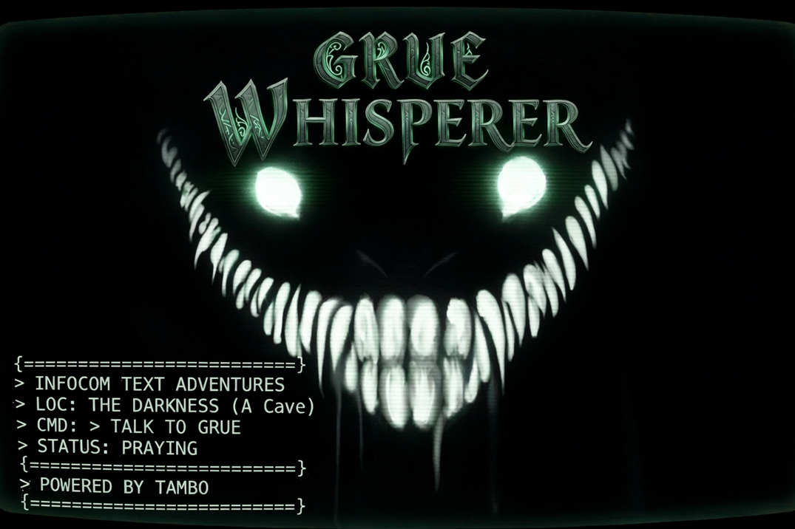

<h1 align="center">
  
</h1>

Play classic Infocom text adventures (Zork I, II, and III) using natural language instead of exact parser commands. Type what you want to do the way you'd say it, and an LLM handles the translation to commands the game actually understands.

This project is part of a [blog series on AI and testing](https://testerstories.com/category/ai/ai-and-testing/) that uses it as a working example of how LLM-powered interfaces change what it means to test a piece of software.

---

## What It Means

Grue Whisperer is a Tambo demo that lets users play classic Infocom text adventures using natural language. It demonstrates Tambo's tool calling capabilities by translating conversational input into Z-machine parser commands.

The "whisperer" framing comes from the **horse whisperer** tradition: the idea of someone who can communicate with a creature or system that others find opaque, dangerous, or unpredictable, through a kind of intimate, low-key fluency rather than brute force.

The classic example is the 1998 film (and the Robert Redford archetype it popularized), but the underlying concept is older: the idea that you don't command a wild or difficult thing, you speak its language. The term then proliferated culturally: dog whisperer, ghost whisperer, etc.

Applied to **Grue Whisperer**, there are a few layers working simultaneously:

- The **grue** is the iconic Infocom monster: dangerous, lurking in darkness, something you can't see or directly confront. It kills you if you blunder into it.
- A "whisperer" doesn't blunder. They approach carefully, with understanding.
- Natural language AI as the medium fits perfectly. You're not typing rigid parser commands anymore, you're conversing with the darkness.

There's also a nice inversion buried in it: in *Zork*, the grue is what you fear. The whisperer implies you've flipped the power dynamic: you're the one who understands the dark, not the one threatened by it.

---

## How It Works

### The Z-Machine

The games run entirely in your browser. Infocom built the Z-Machine in the late 1970s as a portable virtual machine, which meant the same compiled story file could run unchanged on dozens of incompatible home computers by shipping a thin interpreter for each platform. The game data itself has never changed.

This project uses my own [Voxam](https://github.com/jeffnyman/voxam-zmachine) project, a JavaScript Z-Machine interpreter, to run the original story files. When the game starts, Voxam loads the story file, runs it until it waits for input, and returns the opening text. Every subsequent player command is passed to the Z-Machine, which advances the story and returns a response.

### The LLM Layer

Classic text adventure parsers are brittle. _PUT LAMP IN CASE_ works; _leave the lantern with the other treasures_ does not. This project layers an LLM between the player and the parser using [Tambo](https://tambo.co), which handles conversation history, streaming responses, and tool orchestration.

The flow for each player message is:

1. The player types a message in natural language.
2. Tambo sends the message to the LLM along with the conversation history.
3. The LLM calls the `sendGameCommand` tool with one or more parser commands that match the player's intent.
4. The tool executes each command against the Z-Machine running in the browser and returns the game's response text.
5. The LLM presents the result to the player, rewriting parser errors as in-world moments rather than exposing them.

### The Two Prompts

All model behavior is controlled from a single file: `src/lib/prompts.ts`. There are two prompts and they operate at different levels:

**`systemPrompt`** governs the entire session. It establishes the model's identity as an in-world narrator, defines how it should handle parser errors (rewrite them as narrative, never break the fourth wall), and instructs it to decompose compound player requests into sequential tool calls.

**`commandDescription`** is scoped to the `sendGameCommand` tool call. It tells the model when to call the tool, how to format command strings, and that it must never invent game output. This prompt is intentionally narrower; it reinforces the most critical behaviors at the point where they matter most.

Some instructions appear in both prompts. This is deliberate: repetition across the system prompt and the tool description reinforces behavior that the model must get right consistently.

Both prompts are straightforward strings and can be edited freely to change how the model behaves, such as how much flavor text it adds, how it handles errors, how literally it interprets player input, and so on.

---

## Getting Started

### Prerequisites

- [Node.js](https://nodejs.org/) 18 or later
- A [Tambo](https://tambo.co) account and API key

### Installation

```bash
git clone https://github.com/jeffnyman/grue-whisperer
cd grue-whisperer
npm ci
```

### Tambo Project Setup

1. Log in to [tambo.co](https://tambo.co) and create a new project.
2. In the project settings, enable **Allow system prompt override** (or equivalent). This allows the app to pass its own system prompt via `initialMessages`.
3. Copy your API key from the project dashboard.

### Configuration

```bash
cp .env.example .env
```

Open `.env` and set your Tambo API key:

```
VITE_TAMBO_API_KEY=your_key_here
```

### Running

```bash
npm run dev
```

Open [http://localhost:5173](http://localhost:5173) in your browser.
